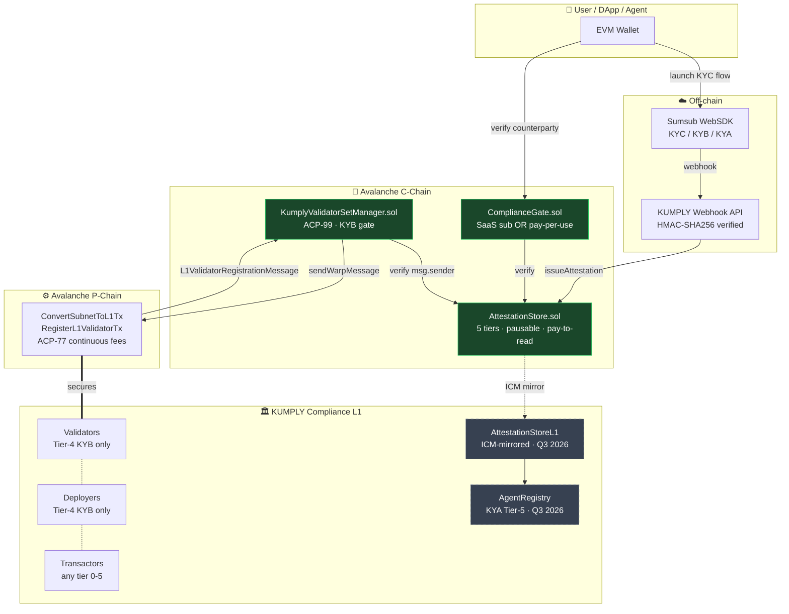
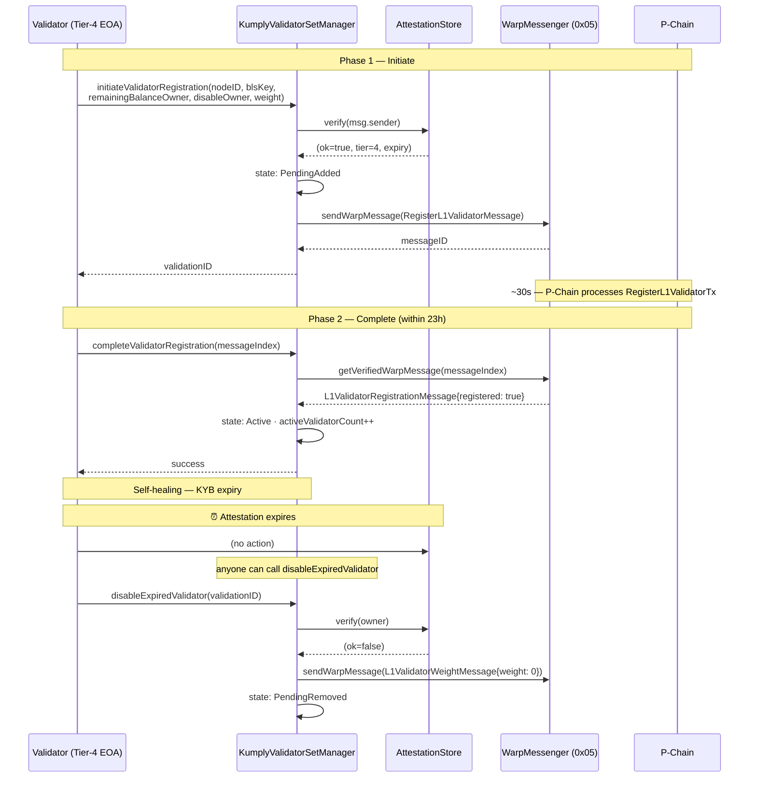
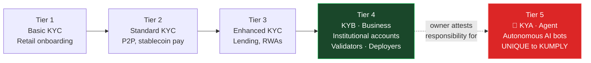
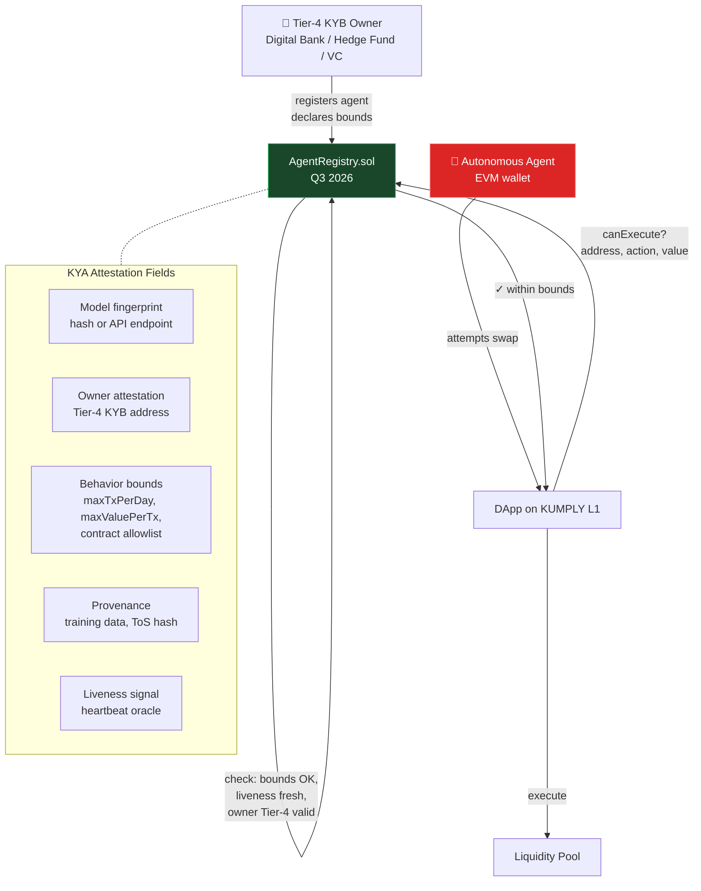
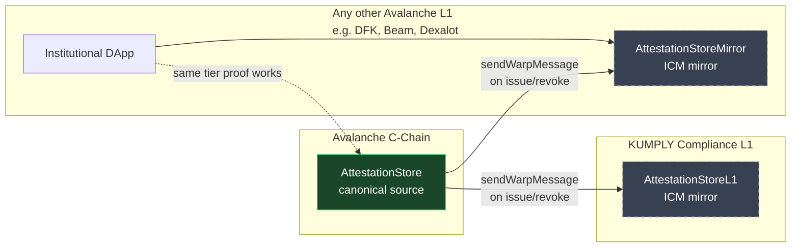

# KUMPLY — Architecture Diagrams

Mermaid diagrams render natively on GitHub. Each can also be exported as PNG/SVG
via the Mermaid Live Editor: https://mermaid.live

---

## 1. End-to-end attestation flow (C-Chain + L1)



---

## 2. ACP-99 two-phase validator lifecycle



---

## 3. 5-tier compliance spectrum



---

## 4. KYA — Know Your Agent (Tier 5)



---

## 5. Cross-L1 attestation propagation (Q3 2026 roadmap)



---

## How to render / export

**On GitHub:** these diagrams render automatically in this `.md` file.

**As PNG/SVG for slide decks or PDF:**
1. Copy any code block (the part between ` ```mermaid ` and ` ``` `).
2. Paste into https://mermaid.live
3. Click `Actions → PNG` or `SVG`.
4. Recommended export size for slides: 1920 × 1080, transparent background.

**For the litepaper PDF:** convert LITEPAPER.md to PDF using `pandoc` with a Mermaid filter
(`mermaid-filter`) or simply embed pre-rendered PNGs from `mermaid.live`.
